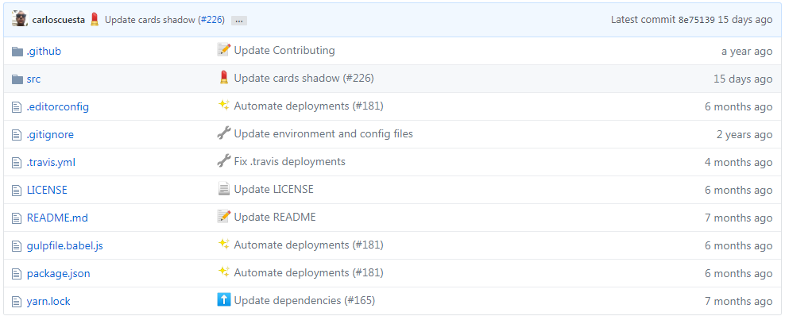
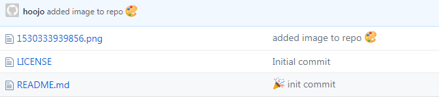

Git Commit emoji Guide   提交表情使用指北
============================

# 前言

[gitmoji](https://gitmoji.carloscuesta.me/)是一个标准化和解释**在GitHub提交消息上使用**[emoji](https://gitmoji.carloscuesta.me/)的倡议。

在`git commit`上使用`emoji`提供了一种简单的方法，仅通过查看所使用的表情符号来**确定提交的目的或意图**。由于有很多不同的表情符号，表情库更新后，没有一个可以帮助更轻松地使用表情符号的中文表情库列表。

# 概述

在执行 `git commit` 指令时使用 `emoji`图标为本次提交添加一个特别的**图标**， 这个本次提交的记录很容易突出重点，或者说光看图标就知道本次提交的目的。这样就方便在日后查看历史提交日子记录中快速的查找到对于的提交版本。

# `emoji` 表情库

emoji 表情                                   | emoji 代码            | commit 说明
:--------                               | :--------                    | :--------
:art: (调色板)                          | `:art:`                      | 改进代码结构/代码格式
:zap: (闪电)<br>:racehorse: (赛马)                            | `:zap:`<br>`:racehorse:`                      | 提升性能
:fire: (火焰)                           | `:fire:`                     | 移除代码或文件
:bug: (bug)                             | `:bug:`                      | 修复 bug
:ambulance: (急救车)                    | `:ambulance:`                | 重要补丁
:sparkles: (火花)                       | `:sparkles:`                 | 引入新功能
:memo: (备忘录)                         | `:memo:`                     | 撰写文档
:rocket: (火箭)                         | `:rocket:`                   | 部署功能
:lipstick: (口红)                       | `:lipstick:`                 | 更新 UI 和样式文件
:tada: (庆祝)                           | `:tada:`                     | 初次提交
:white_check_mark: (白色复选框)         | `:white_check_mark:`         | 增加测试
:lock: (锁)                             | `:lock:`                     | 修复安全问题
:apple: (苹果)                          | `:apple:`                    | 修复 macOS 下的问题
:penguin: (企鹅)                        | `:penguin:`                  | 修复 Linux 下的问题
:checkered_flag: (旗帜)                 | `:checked_flag:`             | 修复 Windows 下的问题
:bookmark: (书签)                       | `:bookmark:`                 | 发行/版本标签
:rotating_light: (警车灯)               | `:rotating_light:`           | 移除 linter 警告
:construction: (施工)                   | `:construction:`               | 工作进行中
:green_heart: (绿心)                    | `:green_heart:`              | 修复 CI 构建问题
:arrow_down: (下降箭头)                 | `:arrow_down:`               | 降级依赖
:arrow_up: (上升箭头)                   | `:arrow_up:`                 | 升级依赖
:construction_worker: (工人)            | `:construction_worker:`      | 添加 CI 构建系统
:chart_with_upwards_trend: (上升趋势图) | `:chart_with_upwards_trend:` | 添加分析或跟踪代码
:hammer: (锤子)                         | `:hammer:`                   | 重大重构
:heavy_minus_sign: (减号)               | `:heavy_minus_sign:`         | 减少一个依赖
:whale: (鲸鱼)                          | `:whale:`                    | Docker 相关工作
:heavy_plus_sign: (加号)                | `:heavy_plus_sign:`          | 增加一个依赖
:wrench: (扳手)                         | `:wrench:`                   | 修改配置文件
:globe_with_meridians: (地球)           | `:globe_with_meridians:`     | 国际化与本地化
:pencil2: (铅笔)                        | `:pencil2:`                  | 修复 typo

# 效果展示

`gitmoji`的使用效果，可以去 [github moji](https://github.com/carloscuesta/gitmoji) 看看使用 `emoji`后效果如下：



# 快速开始

## 快速入门

`git commit`时直接在注释中写入**表情符号**的**代码**部分即可完成表情`emoji`的提交。

**举个栗子**：

```sh
$ git commit -m ':tada: init commit'
$ git commit -m 'added image to repo :art:'
```

**效果展示**：



## 格式与规则

`git commit` 时，提交信息遵循以下格式：

```sh
:emoji1: :emoji2: 不超过 50 个字的摘要，简短描述本次提交，首字母大写，句末不要加句号
提交信息主体，可以详细的信息
引用相关 issue 或 PR 、jira的编号<#110>
```

### 简短格式示例：

```sh
$ git commit -m ":tada: Initialize Repo"
```

### 完整格式示例

```sh
$ git commit -m ':sparkles: Add characters count for commit title (#101) \
:sparkles: Add title characters count \
:white_check_mark: Update spec \
:bookmark: Bump version to 1.8.8 issue #101 '
```

# 在命令行中显示 `emoji`

默认情况下，在命令行中并不会显示出 `emoji`, 仅显示 `emoji` 的符号。不过可以使用 [emojify](https://github.com/mrowa44/emojify) 工具使得在命令行也可显示 emoji, 它是一个 shell 脚本，安装与使用都很简单，在 [这里](https://github.com/mrowa44/emojify) 查看如何安装与使用。


# 交互式客户端


