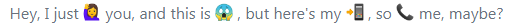

Git Commit emoji Guide   提交表情使用指北
============================

# 前言

[gitmoji](https://gitmoji.carloscuesta.me/)是一个标准化和解释**在GitHub提交消息上使用**[emoji](https://gitmoji.carloscuesta.me/)的倡议。 [gitmoji](https://gitmoji.carloscuesta.me/) 是一个开源项目，专门规定了在 `github` 提交代码时应当遵循的 `emoji `规范 

在`git commit`上使用`emoji`提供了一种简单的方法，仅通过查看所使用的表情符号来**确定提交的目的或意图**。

# 概述

在执行 `git commit` 指令时使用 `emoji`图标为本次提交添加一个特别的**图标**， 这个本次提交的记录很容易突出重点，或者说光看图标就知道本次提交的目的。这样就方便在日后查看历史提交日子记录中快速的查找到对于的提交版本。由于有很多不同的表情符号，表情库更新后，没有一个可以帮助更轻松地使用表情符号的中文表情库列表。所以这里主要列出 `gitmoji`项目中规定的`emoji`规范的表情符号列表。

# `gitmoji` 表情库

| emoji 表情                               | emoji 代码                    | commit 说明                  |
| :--------------------------------------- | :---------------------------- | :--------------------------- |
| :art: (调色板)                           | `:art:`                       | 改进代码结构/代码格式        |
| :zap: (闪电)<br>:racehorse: (赛马)       | `:zap:`<br>`:racehorse:`      | 提升性能                     |
| :fire: (火焰)                            | `:fire:`                      | 移除代码或文件               |
| :bug: (bug)                              | `:bug:`                       | 修复 bug                     |
| :ambulance: (急救车)                     | `:ambulance:`                 | 重要补丁                     |
| :sparkles: (火花)                        | `:sparkles:`                  | 引入新功能                   |
| :memo: (备忘录)                          | `:memo:`                      | 撰写文档                     |
| :rocket: (火箭)                          | `:rocket:`                    | 部署功能                     |
| :lipstick: (口红)                        | `:lipstick:`                  | 更新 UI 和样式文件           |
| :tada: (庆祝)                            | `:tada:`                      | 初次提交                     |
| :white_check_mark: (白色复选框)          | `:white_check_mark:`          | 增加测试                     |
| :lock: (锁)                              | `:lock:`                      | 修复安全问题                 |
| :apple: (苹果)                           | `:apple:`                     | 修复 macOS 下的内容          |
| :penguin: (企鹅)                         | `:penguin:`                   | 修复 Linux 下的内容          |
| :checkered_flag: (旗帜)                  | `:checked_flag:`              | 修复 Windows 下的内容        |
| :robot: (Android机器人)                  | `:robot:`                     | 修复Android上的某些内容。    |
| :green_apple: (绿苹果)                   | `:green_apple:`               | 解决iOS上的某些问题。        |
| :bookmark: (书签)                        | `:bookmark:`                  | 发行/版本标签                |
| :rotating_light: (警车灯)                | `:rotating_light:`            | 移除 linter 警告             |
| :construction: (施工)                    | `:construction:`              | 工作进行中                   |
| :green_heart: (绿心)                     | `:green_heart:`               | 修复 CI 构建问题             |
| :arrow_down: (下降箭头)                  | `:arrow_down:`                | 降级依赖                     |
| :arrow_up: (上升箭头)                    | `:arrow_up:`                  | 升级依赖                     |
| :pushpin: (图钉)                         | `:pushpin:`                   | 将依赖关系固定到特定版本。   |
| :construction_worker: (工人)             | `:construction_worker:`       | 添加 CI 构建系统             |
| :chart_with_upwards_trend: (上升趋势图)  | `:chart_with_upwards_trend:`  | 添加分析或跟踪代码           |
| :recycle: (循环箭头)                     | `:recycle:`                   | 重构代码。                   |
| :hammer: (锤子)                          | `:hammer:`                    | 重大重构                     |
| :heavy_minus_sign: (减号)                | `:heavy_minus_sign:`          | 减少一个依赖                 |
| :whale: (鲸鱼)                           | `:whale:`                     | Docker 相关工作              |
| :heavy_plus_sign: (加号)                 | `:heavy_plus_sign:`           | 增加一个依赖                 |
| :wrench: (扳手)                          | `:wrench:`                    | 修改配置文件                 |
| :globe_with_meridians: (地球)            | `:globe_with_meridians:`      | 国际化与本地化               |
| :pencil2: (铅笔)                         | `:pencil2:`                   | 修复 typo                    |
| :hankey: (瞪眼)                          | `:hankey:`                    | 编写需要改进的错误代码。     |
| :rewind: (双左箭头)                      | `:rewind:`                    | 恢复更改。                   |
| :twisted_rightwards_arrows: (双合并箭头) | `:twisted_rightwards_arrows:` | 合并分支。                   |
| :package: (箱子)                         | `:package:`                   | 更新编译的文件或包。         |
| :alien: (面具)                           | `:alien:`                     | 由于外部API更改而更新代码。  |
| :truck: (面包车)                         | `:truck:`                     | 移动或重命名文件。           |
| :page_facing_up: (文档)                  | `:page_facing_up:`            | 添加或更新许可证。           |
| :boom: (爆炸)                            | `:boom:`                      | 介绍突破性变化。             |
| :bento: (装满餐盘)                       | `:bento:`                     | 添加或更新资产。             |
| :ok_hand: (OK手势)                       | `:ok_hand:`                   | 由于代码审查更改而更新代码。 |
| :wheelchair: (坐姿)                      | `:wheelchair:`                | 提高可访问性。               |
| :bulb: (灯泡)                            | `:bulb:`                      | 记录源代码。                 |
| :beers: (干杯)                           | `:beers:`                     | 醉生梦死的写代码。           |
| :speech_balloon: (提示栏)                | `:speech_balloon:`            | 更新文字和文字。             |
| :card_file_box: (卡片盒子)               | `:card_file_box:`             | 执行与数据库相关的更改。     |
| :loud_sound: (有声喇叭)                  | `:loud_sound:`                | 添加日志。                   |
| :mute: (静音喇叭)                        | `:mute:`                      | 删除日志。                   |
| :busts_in_silhouette: (两个人头)         | `:busts_in_silhouette:`       | 添加贡献者。                 |
| :children_crossing: (小盆友)             | `:children_crossing:`         | 改善用户体验/可用性。        |
| :building_construction: (吊车)           | `:building_construction:`     | 进行架构更改。               |
| :iphone: (手机)                          | `:iphone:`                    | 致力于响应式设计。           |
| :clown_face: (小丑)                      | `:clown_face:`                | 嘲笑事物。                   |
| :egg: (彩蛋)                             | `:egg:`                       | 添加一个复活节彩蛋。         |
| :see_no_evil: (蒙眼猴子)                 | `:see_no_evil:`               | 添加或更新.gitignore文件。   |
| :camera_flash: (照相机)                  | `:camera_flash:`              | 添加或更新快照。             |

# `Windows Emoji` 安装特殊符号更新

如果你的电脑是`Windows`系统无法显示表情符号，那需要Windows 7 字体库中将安装有 `Segoe UI `符号 5.01 版本。下载地址：[KB2729094](http://support.microsoft.com/kb/2729094) 

安装完成后，可以进入[测试地址](http://www.istartedsomething.com/uploads/emojisegoe.html)进行测试

 

# 效果展示

`gitmoji`的使用效果，可以去 [github moji](https://github.com/carloscuesta/gitmoji) 看看使用 `emoji`后效果如下：


# 快速开始

## 快捷方式

将上面的`gitmoji` 表情库内容放入一个普通的文本文件 [git-emoji-list.rst](git-emoji-list.rst)，将文件放入到path环境变量指向的位置，方便需要查看的时候能直接访问查看。

```sh
$ alias emoji='cat $PATH/git-emoji-list.rst'
$ emoji
```

## 快速入门

`git commit`时直接在注释中写入**表情符号**的**代码**部分即可完成表情`emoji`的提交。

**举个栗子**：

```sh
$ git commit -m ':tada: init commit'
$ git commit -m 'added image to repo :art:'
```

**效果展示**：


## 格式与规则

`git commit` 时，提交信息遵循以下格式：

```sh
:emoji1: :emoji2: 不超过 50 个字的摘要，简短描述本次提交，首字母大写，句末不要加句号
提交信息主体，可以详细的信息
引用相关 issue 或 PR 、jira的编号<#110>
```

**简短格式示例**：

```sh
$ git commit -m ":tada: Initialize Repo"
```

**完整格式示例**：

```sh
$ git commit -m ':sparkles: Add characters count for commit title (#101) \
:sparkles: Add title characters count \
:white_check_mark: Update spec \
:bookmark: Bump version to 1.8.8 issue #101 '
```

`github`上注释效果如下：


# `github`在网页上使用`emoji`

在github上提交注释，也可以通过其他项目快速查找`emoji`表情符号。 [Emoji searcher ](http://emoji.muan.co/)列举出了上百上千的表情符号。


或者在[浏览器安装插件](https://github.com/muan/mojibar)的方式 

 

但很多符号不适合软件程序界使用，软件行业的工程师还是使用 [gitmoji](https://gitmoji.carloscuesta.me)

# `emojify` 在命令行中显示 `emoji`

默认情况下，在命令行中并不会显示出 `emoji`, 仅显示 `emoji` 的符号代码或**空字符**符号。


要解决这种情况，可以使用 [emojify](https://github.com/mrowa44/emojify) 工具使得在命令行也可显示 `emoji`表情， 它是一个 shell 脚本，安装与使用都很简单，在 [这里](https://github.com/mrowa44/emojify) 查看官方操作手册如何安装与使用。

## 安装 `emojify`

基本上`emojify`替换许多服务（如`GitHub`）用于表情符号原始字符的表情符号别名。`emojify`是一个`shell`脚本，所以把它放在某个地方并确保它被添加到你的`$PATH`变量中。

```sh
$ sudo sh -c "curl https://raw.githubusercontent.com/mrowa44/emojify/master/emojify -o /usr/local/bin/emojify && chmod +x /usr/local/bin/emojify"
```

**Win7 下安装姿势**

安装了 `git bash` 或者 其他第三方的`Linux` 的`shell`工具

```sh
$ curl https://raw.githubusercontent.com/mrowa44/emojify/master/emojify -o /usr/bin/emojify
```

如果安装后不能使用，可以将路径配置在环境变量的`Path`变量中。

```sh
PATH=/usr/bin/
```


## 使用 `emojify`

```sh
$ emojify "Hey, I just :raising_hand: you, and this is :scream: , but here's my :calling: , so :telephone_receiver: me, maybe?"
```

被替换成表情<br/>

在使用 git bash 的时候，设置替换日志中的表情符号代码

```sh
$ git log --oneline --color | emojify | less -r
```

或者设置`git log`命令别名

```sh
$ alias gitlog='git log --oneline --color | emojify | less -r'

$ gitlog 
```

效果如下：<br/> 

# `gitmoji-cli`交互式客户端

 

[交互式客户端](https://github.com/carloscuesta/gitmoji-cli)是方便在终端使用 `emoji`符号，开源项目提供了终端工具 `gitmoji-cli` 

## 安装

需要使用`npm`，如果没有安装需要单独安装`npm`工具

```sh
$ npm i -g gitmoji-cli
```

## 使用

```sh
$ gitmoji --help
A gitmoji interactive client for using gitmojis on commit messages.

  Usage
    $ gitmoji
  Options
    --init, -i      Initialize gitmoji as a commit hook
    --remove, -r    Remove a previously initialized commit hook
    --config, -g    Setup gitmoji-cli preferences.
    --commit, -c    Interactively commit using the prompts
    --list, -l      List all the available gitmojis
    --search, -s    Search gitmojis
    --version, -v   Print gitmoji-cli installed version
    --update, -u    Sync emoji list with the repo
```

### 查看 `emoji` 列表

```sh
$ gitmoji -l
```

 

### 查找 `emoji` 表情

```sh
$ gitmoji bug linter -s
```

## `Windows` 无法显示 `emoji` 符号和表情

由于`win7/8` 平台无法显示 `emoji` 表情或符号，但是为了方便查找对应表情可以将表情在 `cli` 终端显示用中文展示。

### 本地化翻译

找到`gitmojis.json`文件，在目录 `C:\Users\xxx\.gitmoji` 下。打开`gitmojis.json`文件将 `emoji`内容修改成中文，顺便将`description`描述也翻译成中文。

```json
[{"emoji":"馃帹","entity":"&#x1f3a8;","code":":art:","description":"Improving structure / format of the code.","name":"art"}
```

### 高亮格式化输出

修改后的`json`可以直接显示中文，基本满足使用效果。同时修改下 `gitmoji` 的命令输出效果，格式化下输出和颜色高亮。修改文件 `$node_path\node_global\node_modules\gitmoji-cli\src\gitmoji.js`文件的 `_parseGitmojis`方法

```javascript
  _parseGitmojis (gitmojis) {
    return gitmojis.map(gitmoji => {
      const emoji = gitmoji.emoji
      const code = gitmoji.code
      const description = gitmoji.description

      return console.log('\x1B[33m%s\x1B[39m \t-\t \x1B[34m%s\x1B[39m \t-\t %s', emoji, chalk.blue(code), description)
    })
  }
```

### 效果展示

```sh
$ gitmoji -l
```


```sh
$ gitmoji bug linter -s
```


